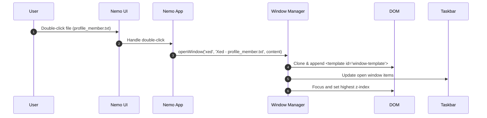

# Design: Linux Mint Cinnamon Desktop Simulator

## Technical Approach
We will build a high-fidelity, single-page application (SPA) simulating the Linux Mint Cinnamon desktop. The UI is built using vanilla HTML5 templates, Tailwind CSS v4 CDN for styling, and ES6 JavaScript for application state and components. The simulation requires zero build steps and loads instantly in the browser.

## Architecture Decisions

| Decision | Option | Tradeoff | Decision |
| :--- | :--- | :--- | :--- |
| **Window Drag & Resize** | Pointer Events API vs Mouse/Touch Events | Pointer Events handles both mouse & touch inputs in a unified listener. Mouse/Touch events require separate implementations. | **Pointer Events API** |
| **Styling & Theme Engine** | Tailwind v4 Utility Classes + CSS Variables vs Tailwind v4 arbitrary classes | Tailwind classes style elements; CSS custom properties (`--mint-accent`) enable dynamic Javascript-driven themes. | **Hybrid**: Tailwind v4 styling with dynamic CSS variables. |
| **Window State Manager** | Vanilla Class vs Reactive Library | A vanilla JS class is zero-dependency, lightweight, and fast to implement. Reactive library requires external CDN scripts. | **Vanilla WindowManager Class** |
| **Application State Store** | JS In-Memory State + LocalStorage vs Redux/Zustand CDN | JS state is simple and fast. Redux/Zustand is overkill for single-page simulated environments. | **In-Memory JS Object + LocalStorage** for persistence. |

## Data Flow
The sequence below illustrates double-clicking a file in Nemo opening Xed:



## File Changes

| File | Action | Description |
|------|--------|-------------|
| `index.html` | Create | Root structure containing desktop, Cinnamon bottom panel, taskbar, templates, and script references. |
| `index.css` | Create | Tailwind v4 configurations, Google Font imports (Inter), custom transitions, glassmorphism, and variable definitions. |
| `app.js` | Create | Application entry point. Dynamic window management logic, pointer listeners, Nemo directory tree, terminal commands, settings storage. |

## Interfaces / Contracts

```javascript
// Window instance shape
interface WindowInstance {
  id: string;        // Unique identifier (e.g. 'win_123')
  title: string;     // Shown in title bar & taskbar
  appId: string;     // 'terminal', 'nemo', 'settings', 'xed'
  x: number;         // Left coordinate in pixels
  y: number;         // Top coordinate in pixels
  width: number;     // Window width
  height: number;    // Window height
  isMinimized: boolean;
  isMaximized: boolean;
  zIndex: number;
}

// Nemo directory tree structure
const VIRTUAL_FS = {
  "/": { type: "dir", children: ["Desktop", "Documents", "Pictures", "About Us"] },
  "/About Us": { type: "dir", children: ["Matias.txt", "Francisco.txt", "Joaquin.txt", "Bautista.txt"] },
  "/About Us/Francisco.txt": { type: "file", content: "Name: Francisco...\nRole: Frontend Developer..." }
};
```

## Detailed Component Designs

### 1. HTML5 Markup
```html
<div id="desktop" class="relative w-screen h-screen overflow-hidden bg-[var(--wallpaper)] select-none">
  <!-- Desktop Icons Grid -->
  <div id="desktop-grid" class="absolute top-4 left-4 grid grid-flow-col auto-cols-[80px] grid-rows-[repeat(auto-fill,90px)] gap-4"></div>
  
  <!-- Window Spawn Zone -->
  <div id="window-zone" class="absolute inset-0 pb-12 pointer-events-none"></div>

  <!-- Cinnamon Panel (Taskbar) -->
  <div id="panel" class="absolute bottom-0 left-0 right-0 h-12 bg-black/60 backdrop-blur-md border-t border-white/10 flex justify-between items-center z-[999999]">
    <div class="flex items-center h-full px-2 gap-2">
      <button id="mint-menu-btn" class="hover:bg-white/10 p-2 rounded">Menu</button>
      <div id="quick-launch" class="flex gap-1"></div>
      <div id="taskbar-items" class="flex gap-1 h-full py-1"></div>
    </div>
    <div id="system-tray" class="flex items-center px-4 gap-3 text-white text-sm">
      <div id="clock"></div>
    </div>
  </div>
</div>
```

### 2. Window Manager and Focus Logic
On click (`pointerdown`), a window's ID is moved to the end of the `zStack` array. Z-indices are recalculated iteratively using `baseZIndex + index`. Dragging and resizing manipulate the window's `.style.left`, `.style.top`, `.style.width`, and `.style.height` via active pointer tracking coordinates.
Under `768px`, CSS classes enforce `!left-0 !top-0 !w-full !h-[calc(100vh-48px)] !transform-none`, disabling drag handlers.

### 3. Mocked Apps
* **Terminal**: Text command input parser maps keys to actions:
  - `theme <light/dark>` toggles classes on `<html>`.
  - `neofetch` outputs hardware mock and ASCII Mint leaf logo.
  - `cat <file>` queries `VIRTUAL_FS`.
* **Nemo**: Maintains current folder path. Double-clicking updates state and rebuilds child list. Files trigger `createWindow` with target Xed contents.
* **System Settings**: Saves to localStorage:
  ```json
  { "theme": "dark", "accent": "mint-green", "wallpaper": "mint-default.jpg" }
  ```
  Applies styles instantly via:
  ```javascript
  document.documentElement.style.setProperty('--mint-accent', accentHex);
  ```

## Testing Strategy

| Layer | What to Test | Approach |
|-------|-------------|----------|
| Unit | Terminal command parser | Mock commands input and verify parsed outputs. |
| Integration | Nemo opening Xed | Trigger Nemo file double-click, check WindowManager registry. |
| E2E / Manual | Responsive layout swap | Resize viewport <768px, confirm drag is disabled, window is maximized. |

## Migration / Rollout
No migration required.

## Open Questions
- [ ] Do we want to persist custom wallpaper upload via base64 in localStorage? (Recommended to restrict to pre-set choices to save storage).
